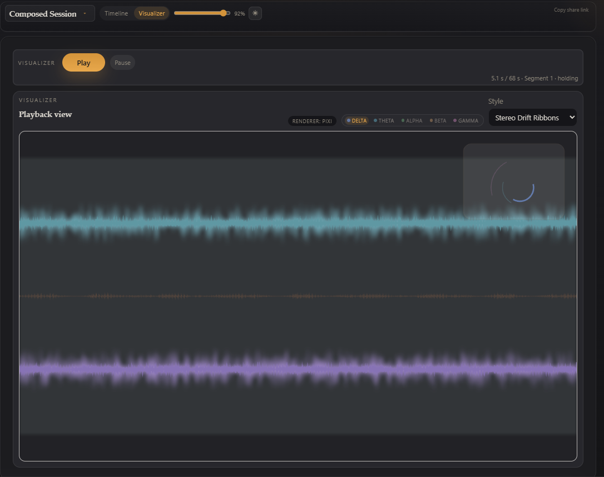
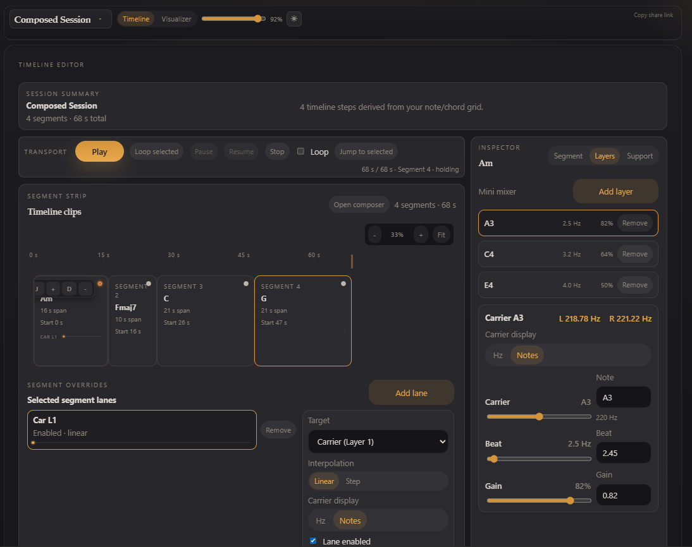

# Neurotone

Neurotone is a browser-based binaural beat editor and player. Design multi-segment sessions with per-layer control over carrier frequencies, beat frequencies, and gain — then play them back with real-time visualizations.

**[Try it live](https://www.rycera.com/neurotone/)**





## Quick Start (for users)

1. Open the app and pick a curated session from the catalog, or click **Create new session** to start from scratch.
2. In the **Timeline** view, use the composer to generate segments from notes/chords, or build them manually with the inspector.
3. Press **Play** to hear your session. Switch to **Visualizer** mode for a full-screen playback experience.
4. Use **segment overrides** to automate parameter changes (carrier frequency, beat frequency, gain) over time within a segment.
5. Click the session name in the header to rename it. Use **Save current session** in the dropdown menu to save to your browser's local storage.
6. Click **Copy share link** to generate a compact URL you can send to anyone — no account required.

## Features

- **Timeline editor** — arrange segments on a timeline with hold durations and crossfade transitions
- **Composer** — generate session timelines from note/chord grids
- **Segment overrides** — keyframe automation lanes for carrier Hz, beat Hz, gain, and noise parameters per segment
- **Multi-layer tone pairs** — stack multiple binaural beat layers per segment with independent tuning
- **Visualizer** — multiple PixiJS-rendered styles (ribbons, waveforms, and more) with real-time band activity
- **Analysis mode** — focused segment-level tuning with detailed frequency and beat breakdowns
- **Session catalog** — browse curated sessions or load saved ones from local storage
- **Dark mode** — Winamp-inspired dark theme with amber accents; toggle via the header button
- **Shareable URLs** — sessions are compressed into URL hash payloads for peer-to-peer sharing
- **Noise bed** — optional background noise (soft, brown, pink, white) mixed into any segment

## Tech Stack

- TypeScript
- Vite
- Web Audio API
- PixiJS v8 (with compatibility fallback renderer)

## Development

```bash
npm install
npm run dev
```

Open [http://localhost:5173](http://localhost:5173).

### Scripts

```bash
npm run dev      # start local dev server
npm run build    # typecheck + production build
npm run preview  # preview production build
npm test         # run test suite
```

### Build Base Path

The production build uses `base: '/neurotone/'` in `vite.config.ts` so assets resolve correctly when hosted under a `/neurotone/` subpath.

## Project Structure

- `src/app.ts` — app UI orchestration and mode routing
- `src/audio/` — Web Audio engine and audio diagnostics helpers
- `src/sequencer/` — session playback model, types, and timeline resolution
- `src/composer/` — note/chord composer and timeline generation
- `src/visualizers/` — visualizer registry, signal synthesis, and band activity logic
- `src/sessionState.ts` — localStorage persistence, theme, and session save/load

## Notes

- Share URLs use compact lz-string compressed hash payloads.
- Visualizer runtime exposes debug state at `window.__neurotoneViz`.
- If PixiJS initialization fails, Neurotone automatically falls back to compatibility rendering.
